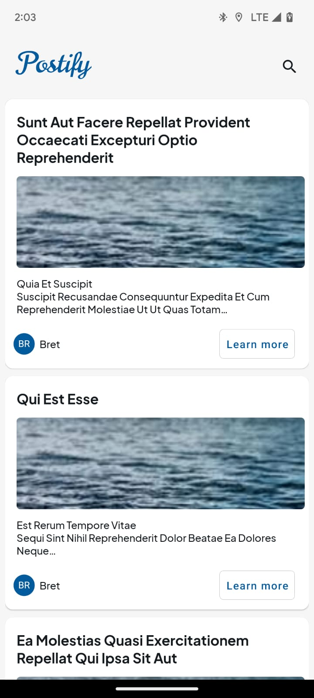
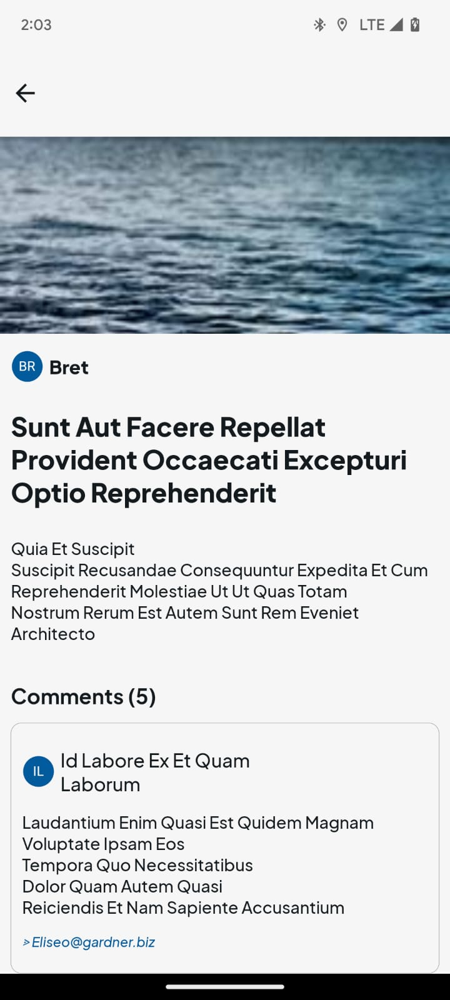
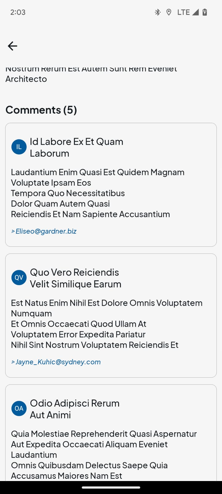
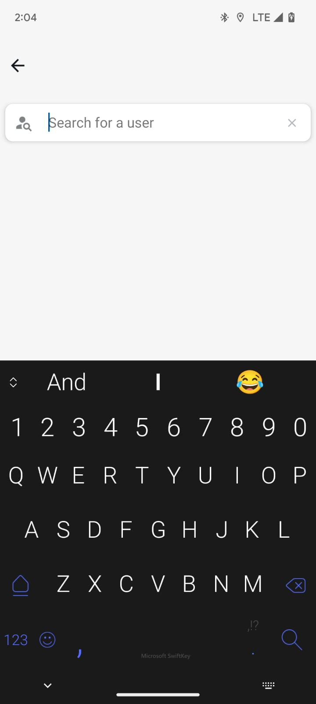
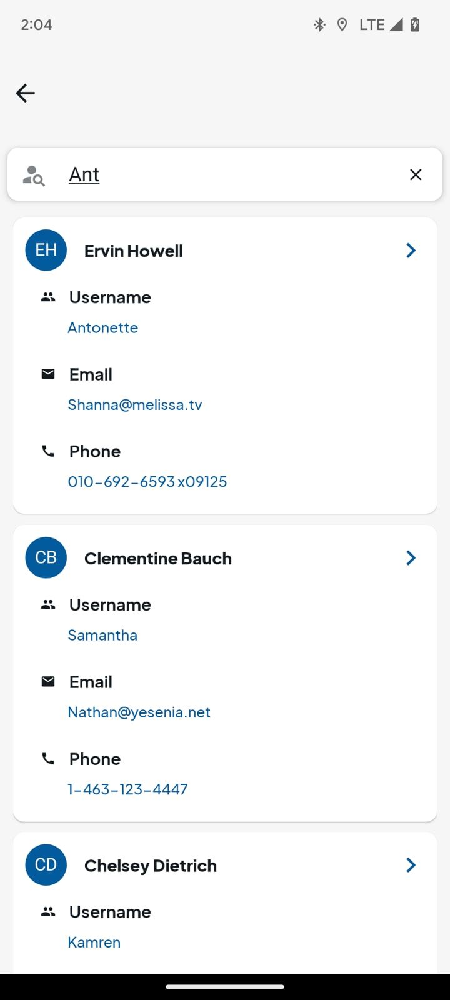
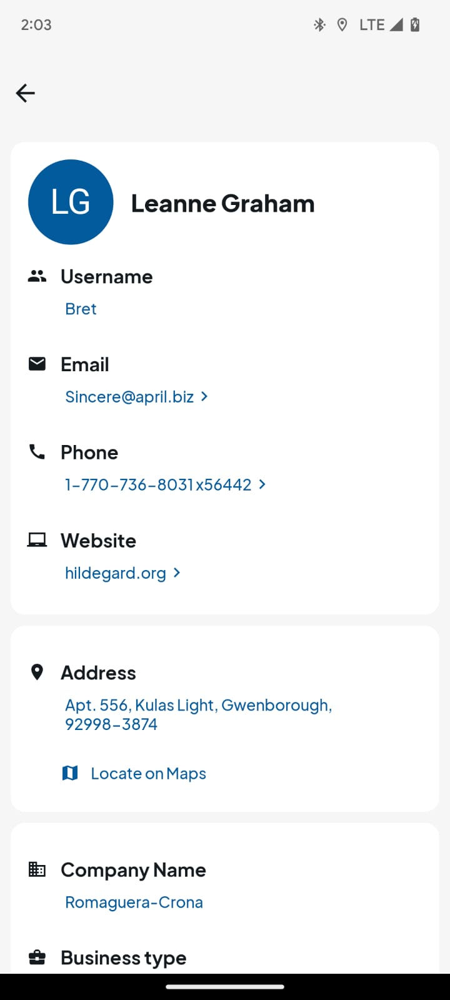

<!-- App Name -->

<p align="center">
  
</p>

## Preview

***
## Screenshots
<p align="center">
  
  
  
  
  
  
  
</p>
*** 

## About
Postify is a React Native project created usin JSONPlaceholder, a very popular service that provides useful fake API for testing and prototyping.
The app is created with React Native version 0.67.4 and utilizes 3rd party libraries like ```react-navigation``` for moving between screens, ```react-native-paper``` for UI components, ```redux``` for State management, ```apisauce``` for API calls etc.

### API endpoints used
- Get Posts data

    ```javascript
        https://jsonplaceholder.typicode.com/posts?_limit=:limit&_embed=comments
    ```
    
    Where ```:limit``` is a custom limit sent to API to generate random number of Posts

- Get User data
    ```javascript
            https://jsonplaceholder.typicode.comusers?id=:user_id
    ```
    
    Where ```:user_id``` is a user ID of the user
    
- Search
    ```javascript
            https://jsonplaceholder.typicode.com/users?q=:search_query
    ```
    
    Where ```:search_query``` is the query phrase sent to API to search for a user


### Postify has 3 screens:
#### Home screen
  - Displays Postify's logo on the left of the header and a search icon on the right which on tapping navigates to the Search screen.
  - Displays a list of 30 posts on opening the app.
  - Each post is a card that displays:
      - Title of the post
      - Dummy cover image
      - Preview of the body of the post
      - Username of the author oF a post => Clicking on the username takes navigates to Profile screen with all the details of the author.
      - Tapping anywhere on the card and the "Learn More" button navigates to individual Post screen.
  - Pulling down to refresh the Home screen generates random number of posts on each refresh.

#### Post screen
  - Displays the cover image on top
  - Displys the Username of the author of the post. Tappin on the Username wiil navigate to the Profile screen with all details of the user
  - Displays the Title of the post
  - Displays the complete Body of the post
  - Each post has a Comment section that displays:
      - The number of comments for that post
      - Username of the commenter
      - Body of the comment
      - Email address of the commemter

 #### Profile screen
  - Displays the full name of the Author/User
  - Displys the Username
  - Displays the Email, tapping on which opens up the email client(GMail, Outlook etc.)
  - Displays the Phone, tapping on which opens up the phone dialer
  - Displays the Website, tapping on which opens up the link in the default browser
  - Displays the Full Address, and a "Locate on Maps" button which opens the default Map for the User's Latitude and Longitude
  - Displays the User's Company name
  - Displays the Company's Busiess type
  - Displays the Company's Catch phrase
    
#### Search screen
  - Tapping the Search icon on top-right of the header navigates to the Search screen.
  - Displys a Search bar which is focused on navigation to the Search screen
  - On typing the search query, an API call is made which returns a list of results if available
  - The result is displayed as a card with bried details such as:
      - Full name of the user
      - Username of the user
      - Email address of the user
      - Phone number of the user
  - Tapping on each card navigates to the Profile screen for that searched user and gives all the details for the user
 
## Notes
- The latest version of React Native (version 0.69.+) was not used for this project because a lot of major 3rd party libraries used in React Native development are still in process of migrating the libraries to the latest version due to React Native's new Architecture introduced recently
- I created the App logo and screenshots using ```Figma```, a design tool for designing and prototyping.